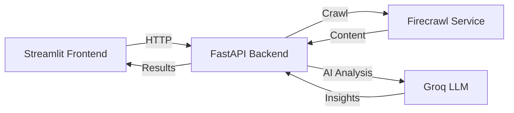

# 🔍 AI SEO + Security Analyzer


A production-grade website analyzer with AI-powered insights. Analyze any website for SEO issues, security signals, and AI/LLM readiness.

## 🎯 Features

This application implements a comprehensive 32-point audit system:

### 📊 On-Page SEO Analysis
- ✅ **Title & Meta**: Checks presence, length, and optimization of Title tags and Meta Descriptions.
- ✅ **Heading Structure**: Verifies exactly one H1 and proper H2/H3 nesting hierarchy.
- ✅ **Content Quality**: Assesses clarity, Flesch-Kincaid readability scores, and detects thin content (<300 words).
- ✅ **Images**: Verifies descriptive `alt` text for all images.
- ✅ **Links**: Checks validity and presence of internal links.
- ✅ **Performance Structure**: Evaluates DOM complexity (element count) as a proxy for page performance.
- ✅ **Best Practices**: Analyzes ranking-related on-page factors.

### 🤖 AEO (Answer Engine Optimization)
*Optimizes your site for AI Search Engines like ChatGPT, Perplexity, and Gemini.*
- ✅ **Question Targeting**: Detects headers starting with Who/What/How/Why/When.
- ✅ **Answer Extraction**: Verifies clear, direct answers immediately following headings.
- ✅ **Conciseness**: Checks if answers fall within the optimal 40–60 word range.
- ✅ **FAQ Structure**: Detects FAQ-style content and Schema markup (FAQPage/HowTo).
- ✅ **AI Readiness**: Checks for `llms.txt` and AI-blocking signals (e.g., `noindex`).

### 🛡️ Security & Trust Signals
- ✅ **HTTPS**: Verifies secure connection availability.
- ✅ **Trust Files**: Detects presence of `robots.txt`, `humans.txt`, and `security.txt`.
- ✅ **Data Safety**: Scans for exposed email addresses to prevent scraping.
- ✅ **Policy Checks**: Validates public trust and policy file accessibility.

### 🧠 AI-Powered Insights
- ✅ **Plain English**: Uses Groq (Llama 3) to translate technical data into beginner-friendly explanations.
- ✅ **Actionable Advice**: Provides non-intrusive, advisory recommendations.
- ✅ **Read-Only**: Performs safe, non-intrusive crawling.

## 🏗️ Architecture



## 🚀 Quick Start

### Prerequisites
- Python 3.9+
- Firecrawl API key (free at [firecrawl.dev](https://firecrawl.dev))
- Groq API key (free at [console.groq.com](https://console.groq.com))

### 1. Clone the Repository
```bash
git clone https://github.com/yourusername/AI_sec_det.git
cd AI_sec_det
```

### 2. Run the Backend (Terminal 1)
The engine that powers the analysis.

```bash
cd backend
pip install -r requirements.txt

# Create .env file from example
# (For Windows)
copy .env.example .env
# (For Mac/Linux)
# cp .env.example .env

# Start Server
python main.py
```
*(Success: Running on http://0.0.0.0:8000)*

### 2. Run the Frontend (Terminal 2)
The visual dashboard.

```bash
cd frontend
streamlit run app.py
```
*(Success: Browser opens at http://localhost:8501)*

## 📖 How to Use
1. **Open** `http://localhost:8501`.
2. **Enter URL** (e.g., `https://example.com`) and click **Analyze**.
3. **View Report**:
   - **SEO Tab**: Structure, Meta, and Content checks.
   - **Security Tab**: Trust files and HTTPS status.
   - **AEO Tab**: AI-readiness and Answer structures.
   - **Quick Fixes**: AI-generated action plan.

## 📁 Project Structure

```
AI_sec_det/
├── backend/                  # FastAPI Logic
│   ├── main.py              # Server Entry
│   ├── app/utils/           # Analysis Modules
│   │   ├── seo_checks.py    # SEO & Content Logic
│   │   ├── security_checks.py # Trust & Files Logic
│   │   ├── aeo_checks.py    # AI Optimization Logic
│   │   └── ai_explainer.py  # Groq/Llama Integration
└── frontend/                # Streamlit UI
    ├── app.py              # Dashboard Code
```

## � License
MIT

---
**Built for Modern Web Standards**
