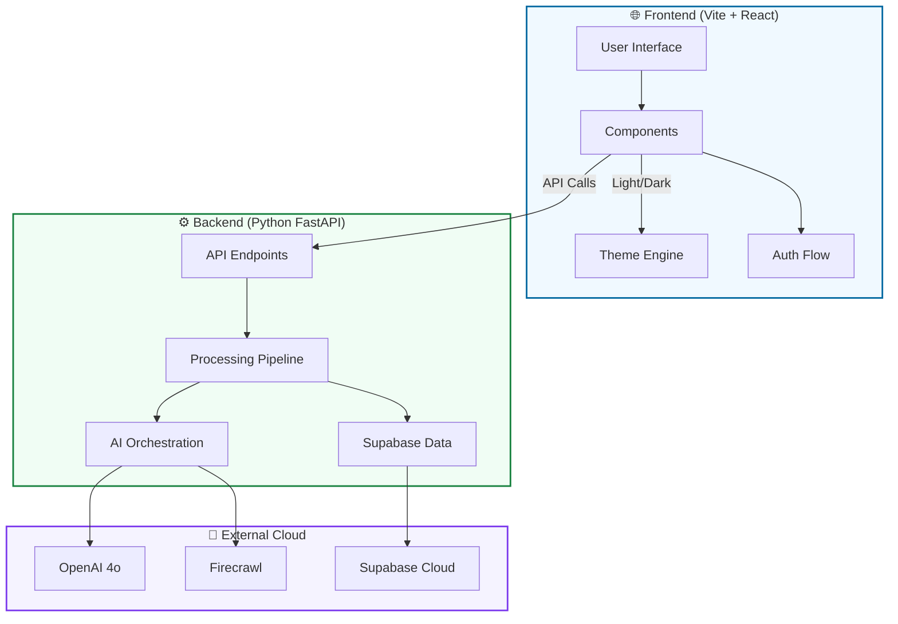

# 🚀 AI SEO Analyzer SaaS

A production-grade, AI-powered SEO and Answer Engine Optimization (AEO) audit tool. Built to give founders and marketers enterprise-level insights with a "supereasy" interface.

## ✨ Core Features
- **🤖 AI-First Analysis**: Uses OpenAI to generate human-readable insights instead of raw data.
- **🕸️ Deep Crawling**: Powered by Firecrawl for high-fidelity, LLM-ready web scraping.
- **🔍 AEO Optimization**: Unique focus on Answer Engine Optimization (ChatGPT, Perplexity, Gemini).
- **🔐 Secure & Persistent**: Full integration with Supabase for Auth (Magic Links/Google) and data storage.
- **📄 Professional PDF Export**: Generate and download beautifully formatted audit reports.
- **🌗 Smart Theming**: Seamless switch between Dark and Light mode.

---

## 🏗️ System Architecture

---

## 🛠️ Tech Stack
- **Frontend**: Vite, React, Tailwind CSS, Framer Motion, Lucide Icons.
- **Backend**: Python, FastAPI, Uvicorn, OpenAI, Firecrawl.
- **Database/Auth**: Supabase (PostgreSQL).
- **Deployment**: Render (Backend), Vercel (Frontend).

---

## 🚀 Local Development

### 1. Prerequisites
- Python 3.12+
- Node.js 18+
- [Supabase](https://supabase.com/) project URL + Keys
- [OpenAI](https://openai.com/) API Key
- [Firecrawl](https://firecrawl.dev/) API Key

### 2. Environment Setup
- **Backend**: Update `backend/.env` (use `.env.example` as guide)
- **Frontend**: Update `frontend_web/.env` (use `.env.example` as guide)

### 3. Run with One-Click Scripts
We provide robust `.bat` scripts for Windows users that handle virtual environments and dependency checks:
- **`start_backend.bat`**: Initializes venv and starts FastAPI at `http://localhost:8000`
- **`start_frontend.bat`**: Installs modules and starts Vite at `http://localhost:5173`

---

## ☁️ Deployment Guide (The Split Plan)

### 1. Backend on Render
1. Create a new **Web Service** on Render.
2. Select your repository.
3. Set the **Root Directory** to `backend`.
4. Render will auto-detect the `render.yaml` and `requirements.txt`.
5. Add your **Environment Variables** in the Render dashboard:
   - `OPENAI_API_KEY`, `FIRECRAWL_API_KEY`, `SUPABASE_URL`, `SUPABASE_ANON_KEY`, `DB_PASSWORD`.

### 2. Frontend on Vercel
1. Create a new Project on Vercel.
2. Set the **Root Directory** to `frontend_web`.
3. Framework Preset: **Vite**.
4. Add **Environment Variables**:
   - `VITE_API_URL`: Your Render backend URL.
   - `VITE_SUPABASE_URL`: Your Supabase URL.
   - `VITE_SUPABASE_ANON_KEY`: Your Supabase Anon Key.
5. Deploy!

---

## 📄 License
MIT License. Built with ❤️ for the SEO Community.
