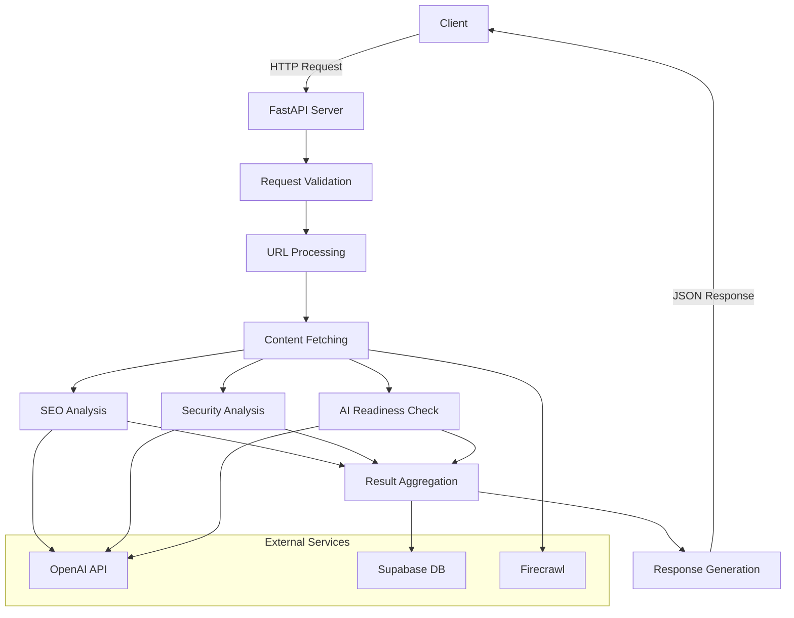

# 🧠 AI SEO Analyzer - Backend Engine

The robust Python FastAPI engine that powers the AI SEO Analyzer. It handles high-fidelity crawling, AI logic orchestration, and secure data persistence.

## 🚀 Key Responsibilities
- **Web Crawling**: Uses the `Firecrawl` API to bypass bot protections and extract clean markdown data.
- **AI Analytics**: Orchestrates OpenAI calls to analyze content for SEO, AEO, and Security issues.
- **Data Persistence**: Saves audit reports to Supabase for historical tracking.
- **API Server**: Provides a high-performance REST API for the React frontend.

## 🏗️ Architecture Overview



### Core Components

1. **API Layer (FastAPI)**
   - RESTful endpoints for analysis requests
   - Request validation and rate limiting
   - Authentication and authorization
   - CORS and security headers

2. **Processing Pipeline**
   - URL validation and normalization
   - Content extraction and cleaning
   - Parallel analysis execution
   - Result aggregation and scoring

3. **Analysis Modules**
   - **SEO Analyzer**: Checks metadata, headings, alt texts, etc.
   - **Security Scanner**: Identifies vulnerabilities and misconfigurations
   - **AI Readiness**: Evaluates content structure for LLM compatibility

4. **Data Layer**
   - Supabase for persistent storage
   - Caching layer for performance
   - Async database operations

5. **External Integrations**
   - OpenAI for advanced analysis
   - Firecrawl for web content extraction
   - Supabase for authentication and storage

## 📦 Setup & Installation

1. **Install Dependencies**:
   ```bash
   pip install -r requirements.txt
   ```

2. **Environment Variables**:
   Create a `.env` file with:
   - `OPENAI_API_KEY`
   - `FIRECRAWL_API_KEY`
   - `SUPABASE_URL`
   - `SUPABASE_KEY` (Service Role or Anon depending on RLS)

3. **Run Server**:
   ```bash
   uvicorn main:app --reload
   ```

## 🛠️ API Endpoints
- `POST /analyze`: Main endpoint. Takes a `{ "url": "..." }` and returns a comprehensive JSON audit.

## ☁️ Deployment (Render)
This backend is optimized for Render. It includes a `Procfile` for automatic deployment. Simply connect your repo and ensure your environment variables are set in the Render dashboard.
