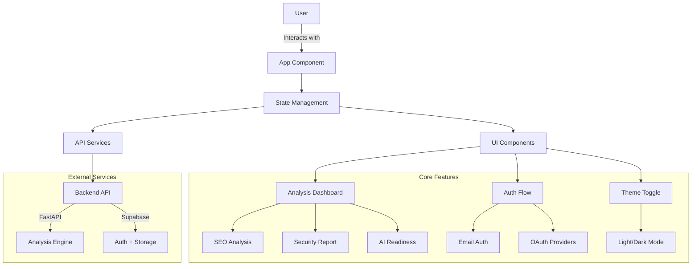

# 🎨 AI SEO Analyzer - Premium Frontend

A state-of-the-art React dashboard designed for speed, clarity, and a premium user experience.

## 🏗️ Architecture Overview



### Core Components

1. **Application Shell**
   - Responsive layout with navigation
   - Theme provider (light/dark mode)
   - Authentication wrapper
   - Error boundaries and loading states

2. **Analysis Dashboard**
   - Real-time analysis results
   - Interactive data visualization
   - Tab-based navigation between report sections
   - Export functionality (PDF/JSON)

3. **Authentication System**
   - Supabase integration
   - Email/password and OAuth providers
   - Protected routes
   - Session management

4. **State Management**
   - React Context for global state
   - Custom hooks for data fetching
   - Local storage for persistence
   - Optimistic UI updates

5. **UI Components**
   - Reusable form elements
   - Animated transitions
   - Responsive design system
   - Accessibility-compliant interfaces

## ✨ Features
- **Modern UI**: Built with Tailwind CSS and Framer Motion for smooth animations and a "Glassmorphism" look.
- **Interactive Reports**: Dynamic tabs for SEO, AEO, and Security insights.
- **Auth Integrated**: Built-in support for Supabase Magic Links and OAuth.
- **Export Engine**: Professional PDF generation logic tailored for SEO audits.
- **Responsive Design**: Fully functional on all device sizes.
- **Progressive Enhancement**: Works with JavaScript disabled (basic functionality).

## 🛠️ Tech Stack
- **React 18** + **Vite**
- **Lucide React** (Icons)
- **Framer Motion** (Animations)
- **Supabase JS Client**

## 📦 Setup & Installation

1. **Install Dependencies**:
   ```bash
   npm install
   ```

2. **Environment Variables**:
   Create a `.env` file with:
   - `VITE_API_URL` (Points to your FastAPI backend)
   - `VITE_SUPABASE_URL`
   - `VITE_SUPABASE_ANON_KEY`

3. **Run Dev Server**:
   ```bash
   npm run dev
   ```

## ☁️ Deployment (Vercel)
This frontend is optimized for Vercel. 
- SPA support is handled via `vercel.json` rewrite rules.
- Fast builds and global edge delivery.
